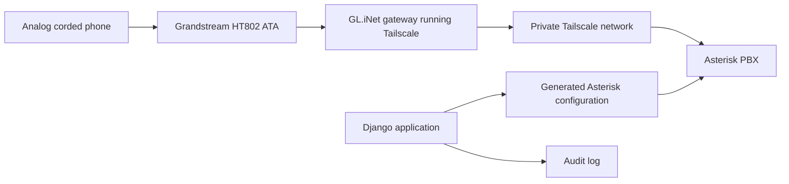

# Architecture

FrontPorch is a private, relationship-based voice communication system for trusted neighborhoods.

The architecture deliberately separates telephony mechanics from application policy. Asterisk handles SIP and media. Django owns the domain model, permissions, audit trail, and generated configuration.

## System Overview

FrontPorch consists of two major systems:

- PBX: Asterisk provides SIP registration, call routing, and media.
- Application: Django manages the domain model and generates PBX configuration.

The application is the source of truth. Asterisk should never become the primary place where families, relationships, or child communication permissions are edited.

## Domain Model

The Django application models the real-world concepts parents care about:

- Families
- Parents and guardians
- Children
- Devices
- Child-device assignments
- Relationships between children and trusted people
- External phone numbers
- Family-specific contact names
- Direct call permissions
- Conference permissions
- Audit events

The application should speak in family and relationship language. SIP extensions, phone numbers, ATA credentials, and dialplan entries are implementation details.

## Parent Control

Everything is relationship-based.

Parents approve relationships, not numbers. A child may be allowed to call devices in another family because both families have approved that child-to-family relationship.

The system should avoid presenting children with a discoverable directory. Children cannot browse other users, probe extensions, or infer who exists in the system.

## External Contacts

External phone numbers should be globally deduplicated by normalized E.164 number.

Families may assign private names to the same underlying number. For example, one family may call a contact "Sophia" while another calls the same phone number "Sophie."

Permissions belong to the relationship between a child and an external number, not to the family-specific display name.

## Group Calls

The default conference policy is restrictive:

- A conference call is allowed for a single child or when parents explicitly create an approved conference group.
- Conference membership and permission changes must be auditable.

Group calling should not become a loophole around direct-call restrictions.

## PBX Integration

Asterisk is responsible for:

- SIP endpoint registration
- Dialplan execution
- Call setup and teardown
- Media handling
- Conference bridge mechanics

Django is responsible for:

- Deciding who may call whom
- Assigning implementation identifiers
- Generating Asterisk configuration
- Producing deterministic dialplans
- Maintaining audit history
- Making permission state inspectable by parents and operators

Generated Asterisk configuration is deterministic: the same application state should produce the same configuration output. Manual edits to generated files should be avoided.

The hand-written configuration under `asterisk/etc/` provides local scaffolding and includes generated FrontPorch files from `asterisk/etc/conf.d/`. Business logic should remain in Django and generated files should be treated as disposable output.

## Networking

FrontPorch runs over Tailscale.

Design assumptions:

- SIP is not exposed to the public Internet.
- Homes do not configure port forwarding.
- Each family has a dedicated gateway on the private network.
- PBX services are reachable only over the tailnet or equivalent private infrastructure.
- Device identity should be tied to provisioned hardware, not to user-entered secrets alone.

The preferred home gateway is a small GL.iNet router running Tailscale. It connects to the family's existing Internet service and provides private connectivity for the ATA and future neighborhood services.

The same gateway may later provide a private Wi-Fi network for community applications such as Minecraft, shared file storage, AI services, or local web apps.

Future gateway provisioning should be automatable from FrontPorch. The long-term direction is for FrontPorch to create or track gateway inventory, family assignment, device naming, Tailscale tags, auth key lifecycle, provisioning status, SIP credentials, and generated gateway artifacts. Early releases may use manually created Tailscale auth keys, but the architecture should not require administrators or families to perform interactive Tailscale login on each gateway.

## Security Model

FrontPorch should be default deny.

Security principles:

- Children cannot discover other users.
- Children cannot dial arbitrary extensions.
- Unknown callers never reach a child's phone.
- Outside calling is disabled unless explicitly enabled.
- All permission changes are auditable.
- Generated PBX configuration reflects application permissions, not informal operator edits.
- Secrets and provisioning data are treated as sensitive infrastructure.

The system should prefer simple, inspectable controls over opaque policy engines.

## Future Evolution

FrontPorch should continue to grow in layers:

1. Extend the current Django domain model with audit history and parent-facing workflows.
2. Broaden deterministic configuration generation for external caller routing and approved conference groups.
3. Expand reliable deployment automation without exposing SIP publicly.
4. Add reliable appliance provisioning for home gateways and ATAs.
5. Reuse the private neighborhood network for additional community services.
6. Evolve FrontPorch into the control plane for gateway onboarding, Tailscale tag management, key lifecycle, and provisioning status.

The architectural boundary should remain stable: the application owns policy, and infrastructure enforces the generated result.
